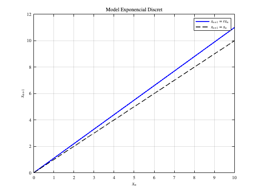
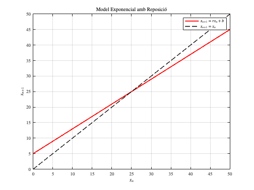
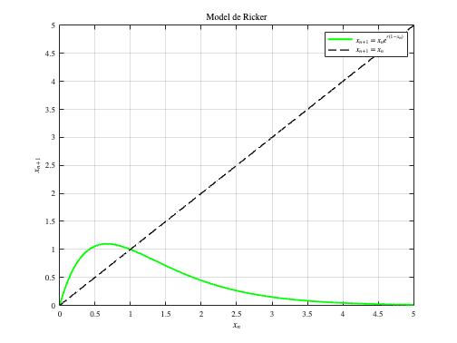
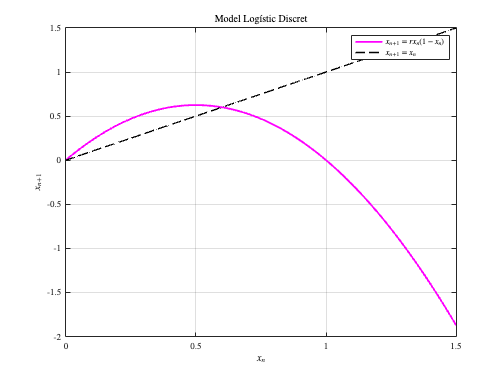
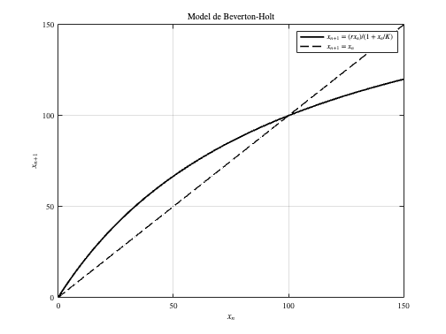
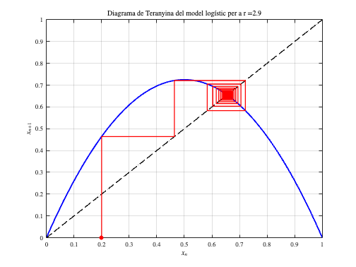

<script src="https://cdn.mathjax.org/mathjax/latest/MathJax.js?config=TeX-AMS-MML_HTMLorMML" type="text/javascript"></script>

#  **1.1.3. Models Unidimensionals. Punts d'equilibri** 
\matlabtableofcontents

**Algunes instruccions preliminars:**

```matlab
startup
```

## Cas: Punts d'equilbri d'un model matemàtic

Suposem que estem modelant el creixement d'una població de conills en una illa amb recursos limitats. Inicialment, la població creix de forma ràpida, però a mesura que s'apropen a la capacitat màxima de l'ecosistema, el creixement es redueix degut a la competència pels recursos. Si la taxa de creixement és de $R$ i la capacitat del sistema és de $K$ , troba els punts d'equilibri i la seva estabilitat per a cadadcun dels models matemàtics treballats.

## Solució
1.  Per tal de trobar els punts d'equilibri ens cal determinar quan $x_{n+1} =f(x_n )$
2. Per tal de trobar si aquests punts són estables o inestables ens cal veure si al voltant del punt la part de l'esquerra d'aquesta expressió creix més o menys ràpidament que la de la dreta. En altres paraules, si avaluem la derivada de l'expressió $x=f(x)$ obtenim $1=f^{\prime } (x)$ . Això ens diu que si $1<|f^{\prime } (x)|$ el terme dret de l'equació creix més ràpidament que l'esquerra, cosa que indica que el punt d'equlibri és inestable. El contrari succeeix si $1>|f^{\prime } (x)|$ , ja que en aquest cas la diagonal té més pendent que la funció.

### Model exponencial discret

Aquest model representa el creixement exponencial d'una població o d'una quantitat en funció del temps.

 $$ x_{n+1} =rx_n $$ 

**Punt d'equilibri:**


Busquem $x_{n+1} =x_n =x^*$ :

 $$ x^* =rx^* $$ 

L'únic punt d'equilibri és $x^* =0$ .


**Estabilitat:**


L'estabilitat depèn del valor de $r$ :


\- Si $|r|<1$ , el punt d'equilibri $x^* =0$ és **estable**.


\- Si $|r|>1$ , el punt d'equilibri $x^* =0$ és **inestable** i la població creix exponencialment.


\- Si $r=1$ , la població roman constant (creixement nul).


```matlab
% Model Exponencial Discret
% x_{n+1} = r * x_n

% Paràmetres
r = 1.1;  % Taxa de creixement
x_vals = linspace(0, 10, 100);  % Domini de x_n

% Funció del model
x_next = r * x_vals;

% Gràfica
figure;
plot(x_vals, x_next, 'b-', 'LineWidth', 2); hold on;
plot(x_vals, x_vals, 'k--', 'LineWidth', 1.5);  % Línia x_{n+1} = x_n
xlabel(' !!!EQ_20!!! ');
ylabel(' !!!EQ_21!!! ');
title('Model Exponencial Discret','Interpreter','latex');
grid on;
legend(' !!!EQ_22!!! ', ' !!!EQ_23!!! ');
hold off;
```




### Model exponencial amb reposició (creixement afegit)

Aquest model és una variant de l'exponencial, però amb una constant que representa reposició o immigració constant.

 $$ x_{n+1} =rx_n +b $$ 


on $r$ és la taxa de creixement i $b$ és la constant de reposició (natalitat afegida o immigració).


**Punt d'equilibri:**


Busquem $x_{n+1} =x_n =x^*$ :

 $$ x^* =rx^* +b $$ 

Resolent per $x^*$ :

 $$ x^* =\frac{b}{1-r},~~\textrm{si}\;r\not= 1 $$ 

**Estabilitat**:


L'estabilitat depèn de $r$ :


\- Si $|r|<1$ , el punt d’equilibri $x^* =\frac{b}{1-r}$  és **estable**.


\- Si $|r|>1$ , el punt d’equilibri és **inestable**.

```matlab
% Model Exponencial amb Reposició
% x_{n+1} = r * x_n + b

% Paràmetres
r = 0.8;  % Taxa de creixement
b = 5;    % Reposició constant
x_vals = linspace(0, 50, 100);  % Domini de x_n

% Funció del model
x_next = r * x_vals + b;

% Gràfica
figure;
plot(x_vals, x_next, 'r-', 'LineWidth', 2); hold on;
plot(x_vals, x_vals, 'k--', 'LineWidth', 1.5);  % Línia x_{n+1} = x_n
xlabel(' $x_n$ ');
ylabel(' $x_{n+1}$ ');
title('Model Exponencial amb Reposici\''o','Interpreter','latex');
grid on;
legend(' $x_{n+1} = r x_n + b$ ', ' $x_{n+1} = x_n$ ');
hold off;
```




\-


### Model de Ricker

El model de Ricker s'utilitza sovint per descriure el creixement de poblacions amb densitat dependent, però que poden superar la capacitat de càrrega abans de decaure. El model inclou una retroalimentació negativa a través de la densitat de població.

 $$ N_{t+1} =N_t e^{r\left(1-\frac{N_t }{K}\right)} $$ 

on $R=e^r$ . Aquest model genera fluctuacions i fins i tot caos per a certs valors de $r$ especialment si la taxa de creixement és molt alta. Si treballem amb la variable $x_n =\frac{N_t }{K}$ podem simplificar l'expressió:

 $$ x_{n+1} =x_n e^{r(1-x_n )} $$ 

**Punt d'equilibri:**


Busquem $x_{n+1} =x_n =x^*$ :

 $$ x^* =x^* e^{r(1-x^* )} $$ 

Això implica que:

 $$ x^* =0~~\textrm{o}~~x^* =1. $$ 

**Estabilitat:**


La derivada de $f(x)=xe^{r(1-x)}$ és $f^{\prime } (x)=e^{r(1-x)} (1-rx)$ 

-  Per $x^* =0$ : Per $x^* =0$ , tenim $f^{\prime } (0)=e^r$ . Si $r>0$ , $|f^{\prime } (0)|>1$ , així que $x^* =0$ és **inestable**. 
-  Per $x^* =1$ : La derivada en $x^* =1$ és $f^{\prime } (1)=e^0 (1-r)=1-r$ . El punt d'equilibri $x^* =1$ és **estable** si $0<r<2$ i **inestable** si $r>2$ . 
```matlab
% Model de Ricker
% x_{n+1} = x_n * exp(r * (1 - x_n))

% Paràmetres
r = 1.5;  % Taxa de creixement
x_vals = linspace(0, 5, 100);  % Domini de x_n

% Funció del model
x_next = x_vals .* exp(r * (1 - x_vals));

% Gràfica
figure;
plot(x_vals, x_next, 'g-', 'LineWidth', 2); hold on;
plot(x_vals, x_vals, 'k--', 'LineWidth', 1.5);  % Línia x_{n+1} = x_n
xlabel(' $x_n$ ');
ylabel(' $x_{n+1}$ ');
title('Model de Ricker','Interpreter','latex');
grid on;
legend(' $x_{n+1} = x_n e^{r(1 - x_n)}$ ', ' $x_{n+1} = x_n$ ');
hold off;
```




### Model logístic discret

El model logístic és una de les primeres aproximacions per modelar el creixement d’una població limitada pels recursos. Descriu una situació on la taxa de creixement d'una població disminueix a mesura que aquesta s'acosta a la capacitat de càrrega $K$ , el límit de població que els recursos poden suportar.

   $$ N_{t+1} =N_t \left(R-\frac{R-1}{K}N_t \right) $$ 

   On:


   \- $N_t$ és la població en el temps $t$ 


   \- $R$ és la taxa de creixement,


   \- $K$ és la capacitat de càrrega del sistema.


Fent la mateixa transformació que abans $x_n =\frac{N_t }{K}$ obtenim:

 $$ x_{n+1} =rx_n (1-x_n ) $$ 


**Punt d'equilibri:**


Busquem $x_{n+1} =x_n =x^*$ :

 $$ x^* =rx^* (1-x^* ) $$ 

Això implica:

 $$ x^* =0~~\textrm{o}~~x^* =1-\frac{1}{r},~~\textrm{per}\;r>1. $$ 


**Estabilitat**:


La derivada de $f(x)=rx(1-x)$ és $f^{\prime } (x)=r(1-2x)$ . 

-  Per $x^* =0$ : tenim que $f^{\prime } (0)=r$ . El punt d'equilibri $x^* =0$ és: a) **estable** si $0<r<1$ ; b) **inestable** si $r>1$ . 
-  Per $x^* =1-\frac{1}{r}$ : tenim que $f^{\prime } \left(1-\frac{1}{r}\right)=2-r$ . El punt d'equilibri $x^* =1-\frac{1}{r}$ és: a) **estable** si $1<r<3$ ; b) **inestable** si $r>3$ . 
```matlab
% Model Logístic Discret
% x_{n+1} = r * x_n * (1 - x_n)

% Paràmetres
r = 2.5;  % Taxa de creixement
x_vals = linspace(0, 1.5, 100);  % Domini de x_n

% Funció del model
x_next = r * x_vals .* (1 - x_vals);

% Gràfica
figure;
plot(x_vals, x_next, 'm-', 'LineWidth', 2); hold on;
plot(x_vals, x_vals, 'k--', 'LineWidth', 1.5);  % Línia x_{n+1} = x_n
xlabel(' $x_n$ ');
ylabel(' $x_{n+1}$ ');
title('Model Log\''istic Discret','Interpreter','latex');
grid on;
legend(' $x_{n+1} = r x_n (1 - x_n)$ ', ' $x_{n+1} = x_n$ ');
hold off;
```



### Model de Beverton\-Holt

   El model de Beverton\-Holt descriu la dinàmica de poblacions amb un mecanisme de compensació de densitat, en el qual la població s'apropa de manera més suau a la capacitat de càrrega sense oscil·lacions. Sovint s'utilitza per espècies on la competència pels recursos no causa grans fluctuacions.

 $$ N_{t+1} =\frac{RN_t }{1+\frac{(R-1)N_t }{K}} $$ 

Deriva punts d'equilibri i la seva estabilitat en funció dels valors de R i K.


```matlab
% Model de Beverton-Holt
% x_{n+1} = (r * x_n) / (1 + (x_n / K))

% Paràmetres
r = 2;  % Taxa de creixement
K = 100;  % Capacitat de càrrega
x_vals = linspace(0, 150, 100);  % Domini de x_n

% Funció del model
x_next = (r * x_vals) ./ (1 + (x_vals / K));

% Gràfica
figure;
plot(x_vals, x_next, 'k-', 'LineWidth', 2); hold on;
plot(x_vals, x_vals, 'k--', 'LineWidth', 1.5);  % Línia x_{n+1} = x_n
xlabel(' !!!EQ_20!!! ');
ylabel(' !!!EQ_21!!! ');
title('Model de Beverton-Holt');
grid on;
legend(' !!!EQ_107!!! ', ' !!!EQ_23!!! ');
hold off;
```



### Diagrama de teranyina del model logístic

Per simplificar el gràfic, usarem uns eixos $x$ i $y$ que vagin entre zero i el màxim de població. Fixa't que en aquest arxiu matlab fem ús del que en `MATLAB` s'anomena una funció anònima quan definim el model logístic. Compara aquesta instrucció amb la usada en el document [`PeixosModelRestringit.mlx`](https://biocomputing-teaching.github.io/Models-Matematics/PeixosModelRestringit)

```matlab
% Diagrama de Teranyina per al Mapa Logístic
% x_{n+1} = r * x_n * (1 - x_n)

% Paràmetres
r = 2.9;   % Taxa de creixement (pots modificar aquest valor)
x0 = 0.2;  % Condició inicial
iterations = 50;  % Nombre d'iteracions
x_vals = linspace(0, 1, 100);  % Domini de x_n

% Funció del mapa logístic fent servir una funció anònima de matlab
f = @(x) r * x .* (1 - x);

% Iteració per generar els punts del diagrama de teranyina
x = x0;
cobweb_x = [x];  % Emmagatzema els punts per a la teranyina
cobweb_y = [0];  % Punt inicial per a la teranyina

for i = 1:iterations
    y = f(x);  % Calcula el següent punt en el mapa logístic
    cobweb_x = [cobweb_x, x, x];  % Afegeix punts per a les línies verticals i horitzontals
    cobweb_y = [cobweb_y, x, y];  % Valors y corresponents
    x = y;  % Actualitza x per a la següent iteració
end

% Gràfica de la funció del mapa logístic
figure;
plot(x_vals, f(x_vals), 'b-', 'LineWidth', 2); hold on;
plot(x_vals, x_vals, 'k--', 'LineWidth', 1.5);  % Gràfica de la diagonal x_{n+1} = x_n
xlabel(' $x_n$ ');
ylabel(' $x_{n+1}$ ');
title(strcat('Diagrama de Teranyina del model log\''istic per a r = ', num2str(r)),'Interpreter','latex');
grid on;

% Gràfica dels passos de la teranyina
plot(cobweb_x, cobweb_y, 'r-', 'LineWidth', 1.5);
plot(cobweb_x(1), cobweb_y(1), 'ro', 'MarkerFaceColor', 'r');  % Marca el punt inicial

hold off;
```



## Qüestions
1.  Construeix els [diagrames de teranyines](https://math.libretexts.org/Bookshelves/Scientific_Computing_Simulations_and_Modeling/Introduction_to_the_Modeling_and_Analysis_of_Complex_Systems_%28Sayama%29/05%3A_DiscreteTime_Models_II__Analysis/5.03%3A_5.3_Cobweb_Plots_for_One-Dimensional_Iterative_Maps) de tots els models matemàtics d'aquest fitxer `.mlx`. És interesant veure que en funció dels paràmetres es poden veure situacions de [caos](https://math.libretexts.org/Bookshelves/Scientific_Computing_Simulations_and_Modeling/Introduction_to_the_Modeling_and_Analysis_of_Complex_Systems_(Sayama)/09%3A_Chaos/9.01%3A_Chaos_in_Discrete-Time_Models) i oscil·lacions. Pots identificar\-ne algunes a partir dels resultats dels estudis d'estabilitat de més amunt?
2. Explora el diagrama de teranyines de models matemàtics similars com els següents:

-  Model cúbic: $x_t =x_{t-1}^3 -rx_{t-1}$ 
-  Model sinusoïdal: $x_t =r\sin x_{t-1}$ 
