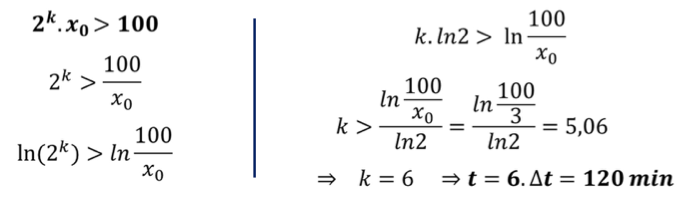
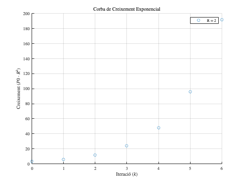
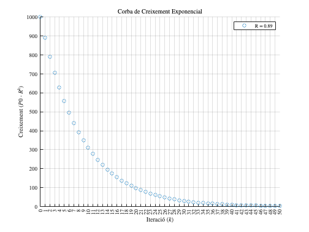
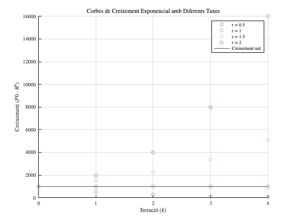
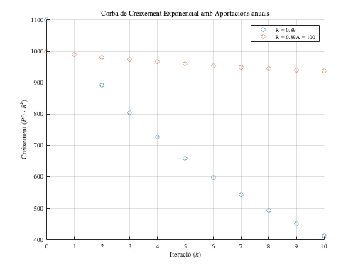
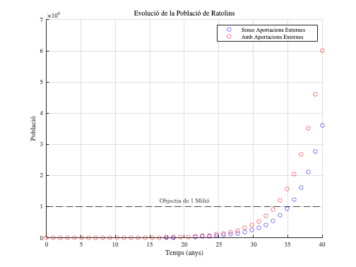

<script src="https://cdn.mathjax.org/mathjax/latest/MathJax.js?config=TeX-AMS-MML_HTMLorMML" type="text/javascript"></script>

# **1.1.1. Models Unidimensionals. Model exponencial**
\matlabtableofcontents

**Algunes instruccions preliminars:**

```matlab
startup
```

## **Cas pràctic: Quan la població de ratolins arribarà a 1 milió?**

Anem a calcular quants anys trigarà la població de ratolins en una illa deserta a arribar a **1 milió** d'individus en dos escenaris:

1.  **Sense aportacions externes**: la població creix únicament a causa del creixement natural (30% anual).
2. **Amb aportacions externes**: cada any arriben **20 ratolins nous** a l'illa, a més del creixement natural.

## Creixement exponencial

Abans d'afrontar aquest problema, pensem en un cas més senzill. Imaginem una població de bacteris que es duplica cada 20 minuts, a partir d'una població inicial de $P_0$ . Generam una taula que ens mostri aquestes dades:

```matlab
% Assumim una població inicial
P0=3
```

```matlabTextOutput
P0 = 3
```

```matlab
% generem una taula amb les dades per a k=6 generacions
k=[0 1 2 3 4 5 6];
y=[P0 2*P0 2^2*P0 2^3*P0 2^4*P0 2^5*P0 2^6*P0];
%imprimim la taula
fprintf('    t    y \n');
```

```matlabTextOutput
    t    y 
```

```matlab
for r=1:7
    fprintf('%5d%5d\n', k(r), y(r));
end
```

```matlabTextOutput
    0    3
    1    6
    2   12
    3   24
    4   48
    5   96
    6  192
```

Com veiem, el creixement es pot explicar amb una successió exponencial:

 $$ x_k =2\cdot x_{k-1} $$ 

o bé, si ho expressem a partir del primer valor (expressió recursiva):

 $$ x_k =2^k \cdot x_0 $$ 

### Qüestió: quant de temps ha de passar per tal que la població de bacteris superi les 100 unitats?




Podem dibuixar aquestes dades per tal de que s'aprecïi millor aquest creixement exponencial:

```matlab
% Defineix el rang de valors de les generacions k
k = 0:1:6;  % Generació (k)
P0 = 3;   % Població inicial
taxa = 2; % taxa de creixement

% Crea una figura
figure;
hold on;  % Permet superposar múltiples gràfics en la mateixa figura

y = P0*taxa.^k;  % Càlcul del creixement exponencial
scatter(k, y, 'DisplayName', ['R = ', num2str(taxa)]);  % Dibuixa la corba

% Configuració del gràfic
xlabel('Iteraci\''o ( $k$ )');
ylabel('Creixement ( $P0 \cdot R^k$ )');
xticks(k)
title('Corba de Creixement Exponencial');
legend('show');  % Mostra la llegenda
grid on;  % Afegeix quadrícula
hold off;  % Allibera la figura per evitar superposicions
```



Qüestió: Què succeeix si $R<0$ ?


Una fàbrica de paper construïda al costat d'un riu afecta una població de truites, reduint\-ne anualment la seva extensió en un 11%. Si inicialment hi ha 1000 truites, com evoluciona la seva població?

```matlab
% Defineix el rang de valors de les generacions k
k = 0:1:50;  % Generació (k)
P0 = 1000;   % Població inicial
taxa = (1-0.11); % taxa de creixement

% Crea una figura
figure;
hold on;  % Permet superposar múltiples gràfics en la mateixa figura

y = P0*taxa.^k;  % Càlcul del creixement exponencial
scatter(k, y, 'DisplayName', ['R = ', num2str(taxa)]);  % Dibuixa la corba

% Configuració del gràfic
% "latex" és un potent editor de text que s'usa molt per mostrar
% nomenclatura matemàtica, també a MATLAB
xlabel('Iteraci\''o ( $k$ )');
ylabel('Creixement ( $P0 \cdot R^k$ )');
xticks(k)
title('Corba de Creixement Exponencial');
legend('show');  % Mostra la llegenda
grid on;  % Afegeix quadrícula
hold off;  % Allibera la figura per evitar superposicions
```



Provem diverses situacions ara en el mateix gràfic:

```matlab
% Defineix el rang de valors de les generacions k
k = 0:1:4;  % Generació (k)
P0 = 1000;   % Població inicial

% Defineix diverses taxes de creixement exponencial
taxes = [0.5, 1, 1.5, 2];  % Diferents valors de taxa de creixement

% Crea una figura
figure;
hold on;  % Permet superposar múltiples gràfics en la mateixa figura

% Bucle per dibuixar les corbes per a cada taxa de creixement
for i = 1:length(taxes)
    y = P0*taxes(i).^k;  % Càlcul del creixement exponencial
    scatter(k, y, 'DisplayName', ['r = ', num2str(taxes(i))]);  % Dibuixa la corba
end
yline(P0, 'DisplayName', 'Creixement nul')
% Configuració del gràfic
% "latex" és un potent editor de text que s'usa molt per mostrar
% nomenclatura matemàtica, també a MATLAB
xlabel('Iteraci\''o ( $k$ )');
ylabel('Creixement ( $P0 \cdot R^k$ )');
xticks(k)
title('Corbes de Creixement Exponencial amb Diferents Taxes');
legend('show');  % Mostra la llegenda
grid on;  % Afegeix quadrícula
hold off;  % Allibera la figura per evitar superposicions
```



Com podem evitar la desaparició de les truites de més amunt si la seva taxa de creixement resulta negativa, com hem vist? Imaginem que fem una determinada aportació anual de truites per compensar les pèrdues. En aquest cas, el model que n'explica l'evolució seria:

 $$ P(t+1)=P(t)\cdot (1+r)+A $$ 
```matlab
% Defineix el rang de valors de les generacions k
k = 0:1:10;  % Generació (k)
P0 = 1000;   % Població inicial
taxa = (1-0.11); % taxa de creixement
A = 100;    % aportació anual

figure;hold on; 

% gràfic sense aportació
y = P0*taxa.^k+A;  % Càlcul del creixement exponencial
scatter(k, y, 'DisplayName', ['R = ', num2str(taxa)]);  % Dibuixa la corba
% gràfic amb aportació. En aquest cas farem una iteració perquè la f`romula
% no és trivial d'entrada (la veurem més avall)
P_t = zeros(size(k));
P_t(1)=P0;

% Iterar fins arribar a la població objectiu
for i = 2:numel(k)
    P_t(i) = P_t(i-1) * taxa + A; % Càlcul de la població
end
scatter(k, P_t, 'DisplayName', ['R = ', num2str(taxa),'A = ',num2str(A)]);  % Dibuixa la corba

xlabel('Iteraci\''o ( $k$ )');
ylabel('Creixement ( $P0 \cdot R^k$ )');
xticks(k)
title('Corba de Creixement Exponencial amb Aportacions anuals');
legend('show');grid on;hold off; 
```



Com es pot verificar al gràfic, al cap del temps haurem pogut estabilitzar la població. 

## **Tornem al cas**
### **Opció 1: Sense aportacions externes**

Per aquest escenari, només tenim el creixement natural exponencial, de manera que podem utilitzar la fórmula bàsica del creixement poblacional exponencial:

 $$ P(t+1)=P(t)\cdot (1+r) $$ 

 $$ P(t)=P(0)\cdot (1+r)^t $$ 

On:

-  $P(t)=1.000.000$ (la població objectiu és d'1 milió de ratolins), 
-  $P(0)=100$ (població inicial), 
-  $r=0,3$ (taxa de creixement natural anual del 30%). 

Per saber quan tardaríem a tenir el milió de ratolins:

 $$ P(t)=P(0)\cdot (1+r)^t \ge 10^6 $$ 

 $$ \log (P(0)\cdot (1+r)^t )\ge \log (10^6 ) $$ 

 $$ \log (P(0))+t\log (1+r)\ge \log (10^6 ) $$ 

 $$ 3+t\log (0.89)\ge 6 $$ 

 $$ t\ge \frac{3}{\log (0.89)} $$ 
```matlab
4/log10(1.3)
```

```matlabTextOutput
ans = 35.1052
```

o, executat tot amb matlab:

```matlab
% Paràmetres inicials

P0 = 100;        % Població inicial
r = 0.30;        % Taxa de creixement natural (30%)
P_target = 1e6;  % Objectiu de població (1 milió)

% Càlcul del temps necessari per arribar a 1 milió de ratolins
t = log(P_target / P0) / log(1 + r);

% Mostrar el resultat
fprintf('Sense aportacions externes, la població arribarà a 1 milió en %.2f anys.\n', t);
```

```matlabTextOutput
Sense aportacions externes, la població arribarà a 1 milió en 35.11 anys.
```

### **Opció 2: Amb aportacions externes**

En aquest escenari, utilitzem la fórmula de Malthus amb aportacions externes:

 $$ P(t+1)=P(t)\cdot (1+r)+A $$ 

Es un exercici no trivial pero interessant veure que la formula basica es:

 $$ P(t)=P(0)\cdot (1+r)^t +A\cdot \frac{(1+r)^t -1}{r} $$ 

On, a part dels parametres definits mes amunt:

-  $A=20$ (aportació externa constant de ratolins per any). 

En aquest cas, enlloc d'usar la formula basica, mostrarem com construir un proces iteratu per a cercar el valor desitjat:

```matlab
% Paràmetres inicials
P0 = 100;        % Població inicial
r = 0.30;        % Taxa de creixement natural (30%)
A = 20;          % Aportacions externes (20 ratolins per any)
P_target = 1e6;  % Objectiu de població (1 milió)

% Inicialització de variables
t = 0;           % Temps inicial
P_t = P0;        % Població inicial

% Iterar fins arribar a la població objectiu
while P_t < P_target
    t = t + 1; 
    P_t = P_t * (1 + r) + A; % Càlcul de la població
    fprintf('t=%d P_t=%d\n',t,P_t)
end
```

```matlabTextOutput
t=1 P_t=150
t=2 P_t=215
t=3 P_t=2.995000e+02
t=4 P_t=4.093500e+02
t=5 P_t=5.521550e+02
t=6 P_t=7.378015e+02
t=7 P_t=9.791420e+02
t=8 P_t=1.292885e+03
t=9 P_t=1.700750e+03
t=10 P_t=2.230975e+03
t=11 P_t=2.920267e+03
t=12 P_t=3.816348e+03
t=13 P_t=4.981252e+03
t=14 P_t=6.495627e+03
t=15 P_t=8.464316e+03
t=16 P_t=1.102361e+04
t=17 P_t=1.435069e+04
t=18 P_t=1.867590e+04
t=19 P_t=2.429867e+04
t=20 P_t=3.160827e+04
t=21 P_t=4.111075e+04
t=22 P_t=5.346398e+04
t=23 P_t=6.952318e+04
t=24 P_t=9.040013e+04
t=25 P_t=1.175402e+05
t=26 P_t=1.528222e+05
t=27 P_t=1.986889e+05
t=28 P_t=2.583155e+05
t=29 P_t=3.358302e+05
t=30 P_t=4.365993e+05
t=31 P_t=5.675991e+05
t=32 P_t=7.378988e+05
t=33 P_t=9.592884e+05
t=34 P_t=1.247095e+06
```

```matlab
fprintf('Amb aportacions externes, la població arribarà a 1 milió en %d anys.\n', t);
```

```matlabTextOutput
Amb aportacions externes, la població arribarà a 1 milió en 34 anys.
```

Gràfic del sistema:

```matlab
% Paràmetres inicials
P0 = 100;        % Població inicial
r = 0.30;        % Taxa de creixement natural (30%)
A = 20;          % Aportacions externes (20 ratolins per any)
P_target = 1e6;  % Objectiu de població (1 milió)

% Inicialització de temps
t_max = 40;  % Temps màxim per a la simulació (en anys)

% Inicialitzem vectors per emmagatzemar resultats
t = linspace(0,t_max,40); % Vector de temps
P_no_A = zeros(size(t)); % Població sense aportacions externes
P_with_A = zeros(size(t)); % Població amb aportacions externes

% Càlcul de la població per a cada temps
for i = 1:length(t)
    % Sense aportacions externes
    P_no_A(i) = P0 * (1 + r)^t(i);
    
    % Amb aportacions externes
    P_with_A(i) = P0 * (1 + r)^t(i) + A * ((1 + r)^t(i) - 1) / r;
end

% Dibuixant les corbes
figure;
scatter(t, P_no_A, 'b'); % Corba sense aportacions externes
hold on;
scatter(t, P_with_A, 'r'); % Corba amb aportacions externes
yl=yline(P_target, '--k', 'Objectiu de 1 Mili\''o','Interpreter','latex'); % Línia horitzontal per l'objectiu
yl.LabelHorizontalAlignment = 'center';
xlabel('Temps (anys)');
ylabel('Poblaci\''o');
title('Evoluci\''o de la Poblaci\''o de Ratolins');
legend('Sense Aportacions Externes', 'Amb Aportacions Externes');
grid on;
hold off;
```



```matlab
%saveas(gcf, '../figures/MalthusRatolins.png');
```
