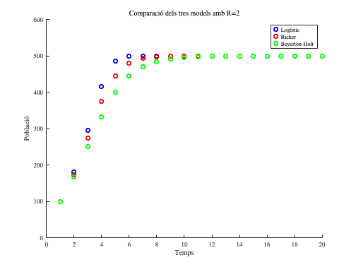
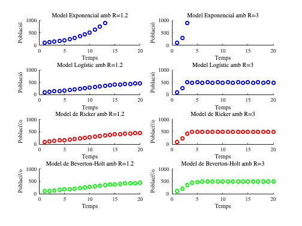
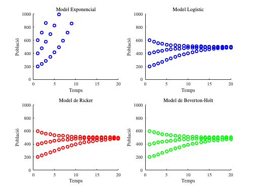
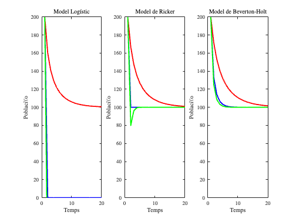
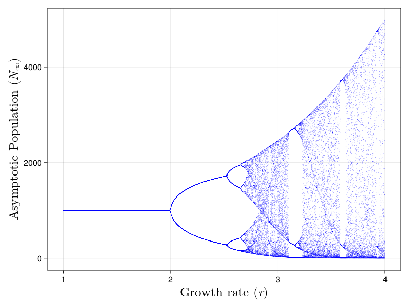
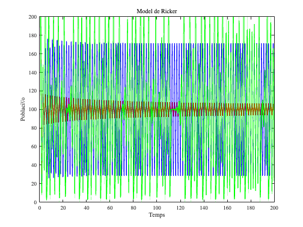

<script src="https://cdn.mathjax.org/mathjax/latest/MathJax.js?config=TeX-AMS-MML_HTMLorMML" type="text/javascript"></script>

# **1.1.2. Models Unidimensionals. Models de creixement restringit**
\matlabtableofcontents

**Algunes instruccions preliminars:**

```matlab
startup
```


## Cas: Estudi d'una població de peixos en un llac

Suposem que estem estudiant la població de peixos d’una espècie concreta en un llac tancat, on no hi ha migració, és a dir, l'únic factor que afecta el creixement de la població són els naixements i les morts. A mesura que la població augmenta, l’accés als recursos com l’aliment o l’espai disminueix, de manera que la taxa de creixement de la població es veu afectada per la densitat. Com es comportarà la població al llarg del temps?

## Models clàssics per al creixement sotmès a restriccions

Els models matemàtics **logístic**, de **Ricker** i de  **Beverton\-Holt** són utilitzats per a descriure la dinàmica de poblacions biològiques i com aquestes responen a factors com la densitat de població i els recursos disponibles. Un cas on es podrien comparar aquests tres models seria l’estudi d’una població de peixos en un llac tancat, on la densitat de la població afecta la seva taxa de creixement i les seves dinàmiques.

### Model logístic

   El model logístic és una de les primeres aproximacions per modelar el creixement d’una població limitada pels recursos. Descriu una situació on la taxa de creixement d'una població disminueix a mesura que aquesta s'acosta a la capacitat de càrrega $K$ , el límit de població que els recursos poden suportar.

   $$ N_{t+1} =N_t \left(R-\frac{R-1}{K}N_t \right) $$ 

   On:


   \- $N_t$ és la població en el temps $t$ 


   \- $R$ és la taxa de creixement,


   \- $K$ és la capacitat de càrrega del sistema.

### Model de Ricker

   El model de Ricker és utilitzat sovint per a analitzar poblacions amb reproducció discreta (com els peixos), on els adults competeixen amb les noves generacions per recursos. El model també inclou una retroalimentació negativa a través de la densitat de població.

 $$ N_{t+1} =N_t e^{r\left(1-\frac{N_t }{K}\right)} $$ 

on $R=e^r$ . Aquest model genera fluctuacions i fins i tot caos per a certs valors de $r$ especialment si la taxa de creixement és molt alta.

### Model de Beverton\-Holt

   El model de Beverton\-Holt descriu la dinàmica de poblacions amb un mecanisme de compensació de densitat, en el qual la població s'apropa de manera més suau a la capacitat de càrrega sense oscil·lacions. Sovint s'utilitza per espècies on la competència pels recursos no causa grans fluctuacions.

 $$ N_{t+1} =\frac{RN_t }{1+\frac{(R-1)N_t }{K}} $$ 

Aquest model és conegut per predir un equilibri suau i estable de la població, evitant oscil·lacions o caos.


```matlab
% Paràmetres del model
R = 2;     % Taxa de creixement
K = 500;    % Capacitat de càrrega
N0 = 100;    % Població inicial
t_max = 20;  % Nombre de períodes (temps) per a la simulació
time = 1:t_max;
```

Fem les figures aprofitant les funcions definides al final del fitxer

```matlab
figure;
% Model Logístic
subplot(3,1,1);
scatter(time, logistic(R,K,N0,t_max), 'b', 'LineWidth', 2);
title('Model Log\''istic');
xlabel('Temps');
ylabel('Poblaci\''o');
ylim([0 K*1.2]);

% Model de Ricker
subplot(3,1,2);
scatter(time, ricker(R,K,N0,t_max), 'r', 'LineWidth', 2);
title('Model de Ricker');
xlabel('Temps');
ylabel('Poblaci\\''o');
ylim([0 K*1.2]);

% Model de Beverton-Holt
subplot(3,1,3);
scatter(time, beverton(R,K,N0,t_max), 'g', 'LineWidth', 2);
title('Model de Beverton-Holt');
xlabel('Temps');
ylabel('Poblaci\\''o');
ylim([0 K*1.2]);
```


```matlab
% Comparació conjunta en un sol gràfic
figure;
hold on;
scatter(time, logistic(R,K,N0,t_max), 'b', 'LineWidth', 2);
scatter(time, ricker(R,K,N0,t_max), 'r', 'LineWidth', 2);
scatter(time, beverton(R,K,N0,t_max), 'g', 'LineWidth', 2);
titol=strcat('Comparaci\''o dels tres models amb R=',num2str(R));
title(titol,'Interpreter','latex');
xlabel('Temps');
ylabel('Poblaci\''o');
legend('Log\''istic', 'Ricker', 'Beverton-Holt');
ylim([0 K*1.2]);
hold off;
```



## Qüestions

Crea un fitxer `mlx` a partir d'aquest en el qual:

1.  Afegeix una funció que et permeti dibuixar també el gràfic per al model exponencial
2. Genera un gràfic comparatiu dels diferents models en cadascun d'aquests casos: $R=\lbrace 1.2,3\rbrace$
3. Genera un gràfic comparatiu dels diferents models en cadascun d'aquests casos: $N_0 =\lbrace 200,400,600\rbrace$
4. Exporta les diferents figures en fitxers de tipus `.png` que puguis aprofitar després en qualsevol document de text.
5. Discuteix els resultats. En concret, comenta quin model pot ser més útil per a espècies amb comportament de creixement estable, i quin per a espècies amb dinàmiques caòtiques o fluctuants, especialment quan les taxes de reproducció són elevades.

## Respostes
-  Afegeix una funció que et permeti dibuixar també el gràfic per al model exponencial:  **Veure funció** **`N_exp`** **més avall.**  
-  Genera un gràfic comparatiu dels diferents models en cadascun d'aquests casos: $R=\lbrace 1.2,3\rbrace$ 
```matlab
% Paràmetres del model

K = 500;    % Capacitat de càrrega
N0 = 100;    % Població inicial
t_max = 20;  % Nombre de períodes (temps) per a la simulació
time = 1:t_max;

figure;

% Model Exponencial
R = [1.2 3];     % Taxa de creixement
for p=1:2

    % cadena de caràcters (string) amb el valor de R per als títols
    Rval=num2str(R(p));

    subplot(4,2,p);
    scatter(time, exponencial(R(p),N0,t_max), 'b', 'LineWidth', 2);
    title(['Model Exponencial amb R=',Rval]);
    xlabel('Temps');
    ylabel('Poblaci\''o');
    xlim([0 t_max]);
    ylim([0 K*2]);
    
    % Model Logístic
    subplot(4,2,p+2);
    scatter(time, logistic(R(p),K,N0,t_max), 'b', 'LineWidth', 2);
    title(['Model Log\''istic amb R=',Rval]);
    xlabel('Temps');
    ylabel('Poblaci\''o');
    ylim([0 K*2]);
    
    % Model de Ricker
    subplot(4,2,p+4);
    scatter(time, ricker(R(p),K,N0,t_max), 'r', 'LineWidth', 2);
    title(['Model de Ricker amb R=',Rval]);
    xlabel('Temps');
    ylabel('Poblaci\\''o');
    ylim([0 K*2]);
    
    % Model de Beverton-Holt
    subplot(4,2,p+6);
    scatter(time, beverton(R(p),K,N0,t_max), 'g', 'LineWidth', 2);
    title(['Model de Beverton-Holt amb R=',Rval]);
    xlabel('Temps');
    ylabel('Poblaci\\''o');
    ylim([0 K*2]);
end
saveas(gcf, '../figures/VariabilitatRDiscrets.png')
```



-  Genera un gràfic comparatiu dels diferents models en cadascun d'aquests casos: $N_0 =\lbrace 200,400,600\rbrace$ 
```matlab
% Paràmetres del model

K = 500;    % Capacitat de càrrega
R = 1.2;     % Taxa de creixement
t_max = 20;  % Nombre de períodes (temps) per a la simulació
time = 1:t_max;

figure;

for N0=[200,400,600]
    % Model Exponencial
    
    subplot(2,2,1);
    scatter(time, exponencial(R,N0,t_max), 'b', 'LineWidth', 2);hold on;
    title('Model Exponencial');
    xlim([0 t_max]);
    ylim([0 K*2]);
    xlabel('Temps');
    ylabel('Poblaci\''o');

    % Model Logístic
    subplot(2,2,2);
    scatter(time, logistic(R,K,N0,t_max), 'b', 'LineWidth', 2);hold on;
    title('Model Log\''istic');
    xlim([0 t_max]);
    ylim([0 K*2]);
    xlabel('Temps');
    ylabel('Poblaci\''o');

    % Model de Ricker
    subplot(2,2,3);
    scatter(time, ricker(R,K,N0,t_max), 'r', 'LineWidth', 2);hold on;
    title('Model de Ricker');
    xlim([0 t_max]);
    ylim([0 K*2]);
    xlabel('Temps');
    ylabel('Poblaci\''o');

    % Model de Beverton-Holt
    subplot(2,2,4);
    scatter(time, beverton(R,K,N0,t_max), 'g', 'LineWidth', 2);hold on;
    title('Model de Beverton-Holt');
    xlim([0 t_max]);
    ylim([0 K*2]);
    xlabel('Temps');
    ylabel('Poblaci\''o');

end
saveas(gcf, '../figures/VariabilitatN0Discrets.png')
hold off
```



-  Exporta les diferents figures en fitxers de tipus `.png` que puguis aprofitar després en qualsevol document de text:  **he afegit una instrucció** **`saveas(gcf,...)`****després de cada gràfic.** 

-  Discuteix els resultats. En concret, comenta quin model pot ser més útil per a espècies amb comportament de creixement estable, i quin per a espècies amb dinàmiques caòtiques o fluctuants, especialment quan les taxes de reproducció són elevades. 

Per a respondre la pregunta de forma preliminar és útil observar el comportament dels tres models que posen límits al creixement (logístic, Ricker i Beverton\-Holt). Mirem què els passa si usem una població inicial molt més gran que $K$ i diferents valors de $R$ . Clarament, el model logístic presenta problemes d'estabilitat, que es van solucionant parcialment al Ricker i força millor al Beverton\-Holt.

```matlab
% Paràmetres del model
clear;
K = 100;    % Capacitat de càrrega
N0 = 200;    % Població inicial
t_max = 20;  % Nombre de períodes (temps) per a la simulació
time = 1:t_max;
R = [1.2 2 2.5];     % Taxa de creixement
colors = ['r' 'b' 'g'];
for p=1:3
    subplot(1,3,1);
    plot(time, logistic(R(p),K,N0,t_max), colors(p), 'LineWidth', 2);hold on;
    title(['Model Log\''istic']);
    xlabel('Temps');
    ylabel('Poblaci\\''o');
    ylim([0 max(K*2,N0)]);

    subplot(1,3,2);
    plot(time, ricker(R(p),K,N0,t_max), colors(p), 'LineWidth', 2);hold on;
    title(['Model de Ricker']);
    xlabel('Temps');
    ylabel('Poblaci\\''o');
    ylim([0 max(K*2,N0)]);

    subplot(1,3,3);
    plot(time, beverton(R(p),K,N0,t_max), colors(p), 'LineWidth', 2);hold on;
    title(['Model de Beverton-Holt']);
    xlabel('Temps');
    ylabel('Poblaci\\''o');
    ylim([0 max(K*2,N0)]);
end
hold off;
saveas(gcf, '../figures/fluctuacionsRickerLogistic.png');
```



Finalment, no ho treballarem en aquest document, però en el cas del model de Ricker, per exemple, pots consultar [aquesta pàgina](https://en.wikipedia.org/wiki/Ricker_model) per observar com es genera una bifurcació a mesura que anem canviant el valor de $r$ en el model de Ricker i comprovem el diagrama de la figura:





De Snehal Shekatkar, CC BY\-SA 4.0, [https://commons.wikimedia.org/w/index.php?curid=135537628](https://commons.wikimedia.org/w/index.php?curid=135537628)


Mirem què passa en els casos 

1.  $R=\exp (2)\Leftrightarrow r=2$ ;
2. $R=\exp (2.5)\Leftrightarrow r=2.5$ i
3. $R=\exp (3)\Leftrightarrow r=3$ .

En el primer cas, la població tendeix a $K$ , però comença a oscil·lar fortament tot i convergir a aquest valor de $K$ . En el segon, la població es bifurca a dos valors assimptòtics finals (approx $N=170$ i $N=30$ ). Finalment, en el tercer cas, la població tendeix a diversos valors assimptòtics, en una situació de clar caos.

```matlab
% Paràmetres del model
clear;
figure;
K = 100;    % Capacitat de càrrega
N0 = 200;    % Població inicial
t_max = 200;  % Nombre de períodes (temps) per a la simulació
time = 1:t_max;
R = [exp(2) exp(2.5) exp(3)];     % Taxa de creixement
colors = ['r' 'b' 'g'];
for p=1:3
    plot(time, ricker(R(p),K,N0,t_max), colors(p), 'LineWidth', 2);hold on;
    title(['Model de Ricker']);
    xlabel('Temps');
    ylabel('Poblaci\\''o');
    ylim([0 max(K*2,N0)]);
end
hold off;
saveas(gcf, '../figures/chaosRickerLogistic.png');
```



## Funcions
```matlab
function N_logistic = logistic(R,K,N0,t_max)
    N_logistic = zeros(1, t_max);
    N_logistic(1) = N0;
    for t = 1:t_max-1
        N_logistic(t+1) = N_logistic(t) * (R - (R-1)*N_logistic(t) / K);
    end
end
function N_ricker = ricker(R,K,N0,t_max)
    r=log(R);
    N_ricker = zeros(1, t_max);
    N_ricker(1) = N0;
    for t = 1:t_max-1    
        N_ricker(t+1) = N_ricker(t) * exp(r * (1 - N_ricker(t) / K));
    end
end
function N_beverton_holt = beverton(R,K,N0,t_max)
    N_beverton_holt = zeros(1, t_max);
    N_beverton_holt(1) = N0;
    for t = 1:t_max-1        
        N_beverton_holt(t+1) = (R * N_beverton_holt(t)) / (1 + ((R-1)*N_beverton_holt(t) / K));
    end
end

```

# Respostes:
```matlab

function N_exp = exponencial(R,N0,t_max)
    N_exp = zeros(1, t_max);
    N_exp(1) = N0;
    for t = 1:t_max-1
        N_exp(t+1) = N_exp(t) * R;
    end
end
```
